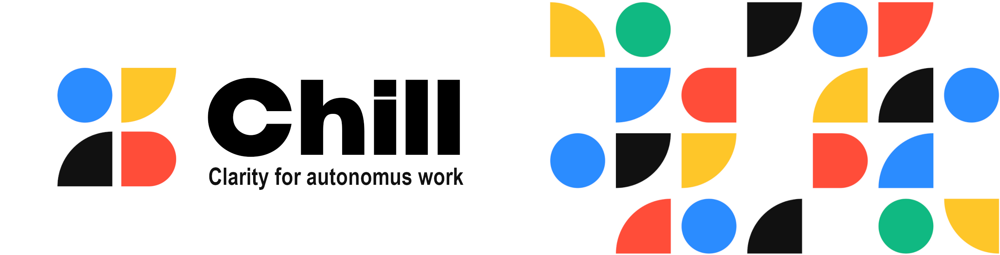

<p>
  
</p>

[English](./README.md) | [Русский](./docs/README.ru.md)

# Chill

**Don't lose the thread when AI does the work.**

> ⚠️ **Early stage**: the plugin ships no skills yet — watch the releases.

AI agents can spend hours exploring code, changing files, running tests, and making engineering decisions.
But the more autonomous the agent becomes, the easier it is for a human to lose track of where the task stands, what has already happened, and what comes next.

**Chill is a set of human-centered skills for working with AI agents that helps you keep clarity and control over long agentic workflows.**

Chill helps you quickly understand:

* what has already been done;
* what is happening right now;
* which decisions were made and why;
* what remains unknown;
* when the work can be safely paused;
* how to get back into it quickly later.

At the core of Chill is the idea of the **Human-Agent State Gap** — the difference between the actual state of an AI agent's work and the human's understanding of that state.

Chill closes this gap not by adding more control over the agent, but through clarity of the process.

**Calm through clarity.**

Read the full product philosophy in [CONCEPT.md](docs/CONCEPT.md).

## Installation

```
/plugin marketplace add tinkml/chill
/plugin install chill@tinkml
```

## License

[MIT](./LICENSE)
